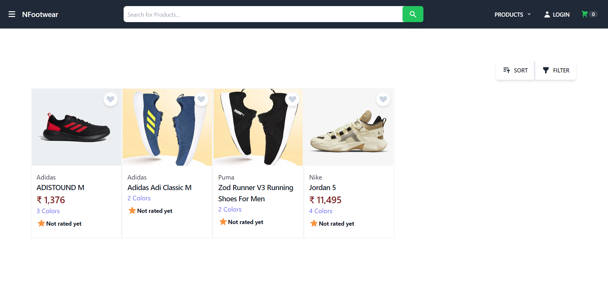
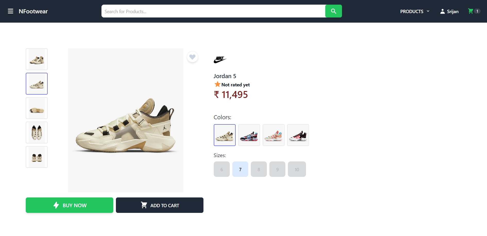
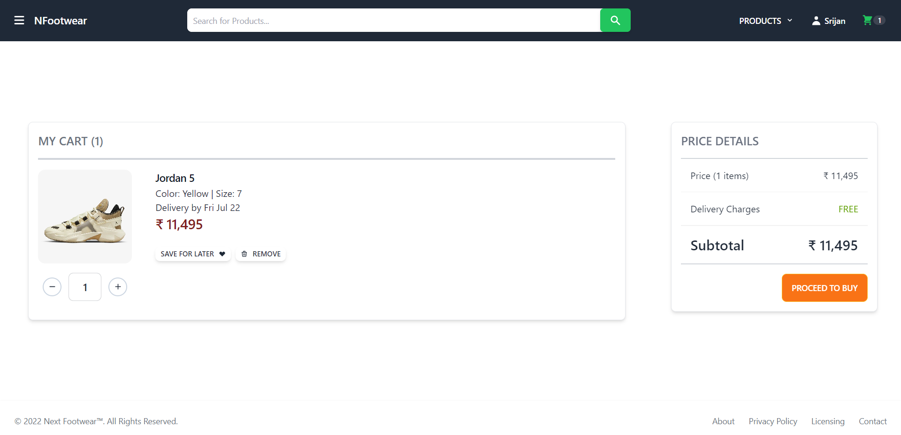

# [Next-Footwear](https://nfootwear.vercel.app/)

Next Footwear is an e-commerce website where you can buy premium footwears of different brands. It ships the products directly from brands to customer to avoid the situation of receiving duplicate or fake products.

## Tech Stack

**Client:** Nextjs, Tailwind-css

**Server:** Python, Django Rest Framework

**Database:** PostgreSql

## [Backend Repo](https://github.com/SrijanDas/next-shoes-api)

## Features

- Fully responsive
- User Authentication with JWT
- Payments with Razorpay

## Features to be added later in the future

- [ ] Wishlist
- [ ] Different Categories of Products (Men, Women, Kids)
- [ ] Offers
- [ ] Add Swiper for Images (Product details page)
- [ ] Verify Email Address

## Preview

